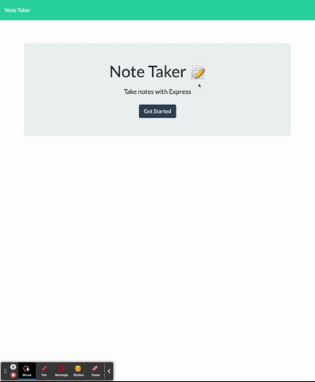
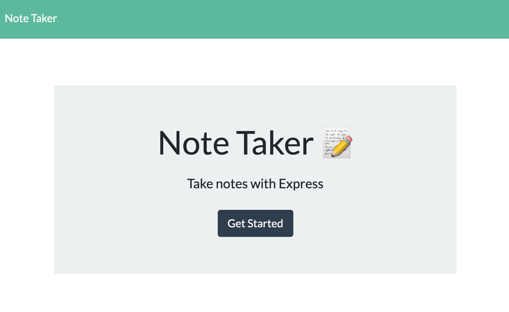
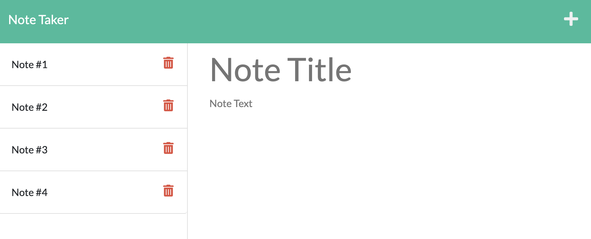
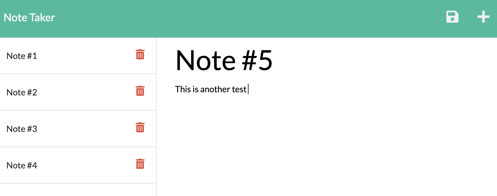
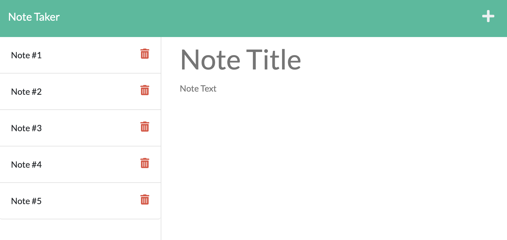

# Note Taker

## GitHub Repository & Deployed Application
* https://github.com/ila0406/Note-Taker
* https://floating-bastion-31403.herokuapp.com/

## 
* [Description](#description)
* [Technolgies Used](#technolgies-used)
* [Installation Instructions](#installation-instructions)
* [Usage Info](#usage-info)
* [Contribution Guide](#contribution-guide)
* [Instructions for testing](#instructions-for-testing)
* [Questions](#questions)
* [Screenshots](#screenshots) 

## 
This is an application called Note Taker that can be used to write and save notes.

## 
* javascript 
* html 
* css 
* node 
* express.js
* Insomnia

## 
1) Run > npm i to install node packages 
2) Run > npm start 
3) Open link to http://localhost:3001/notes

## 
1) Use the following link to access the Note-Taker App https://floating-bastion-31403.herokuapp.com/ 
2) Click on 'Get Started' to enter the note taker app 
3) Enter a note title and Note text 
4) Click on the save Icon

## 
* Starter code was provided by DU and received help from weekly activities

## 
### Demo of Note Taker App

###  Main screen of Note Taker Application

### Once you click 'Get starter' you will be prompted to enter a note title

### Then you will be prompted to enter text for the note

### After entering the note's title and text you can click the save button to move the note to the left 

## 
If you have questions, you can either open a issue in my Github repository  
GitHub: <https://github.com/ila0406>  
 
Or you can send me an email directly  
Email: <ila0406@gmail.com>
